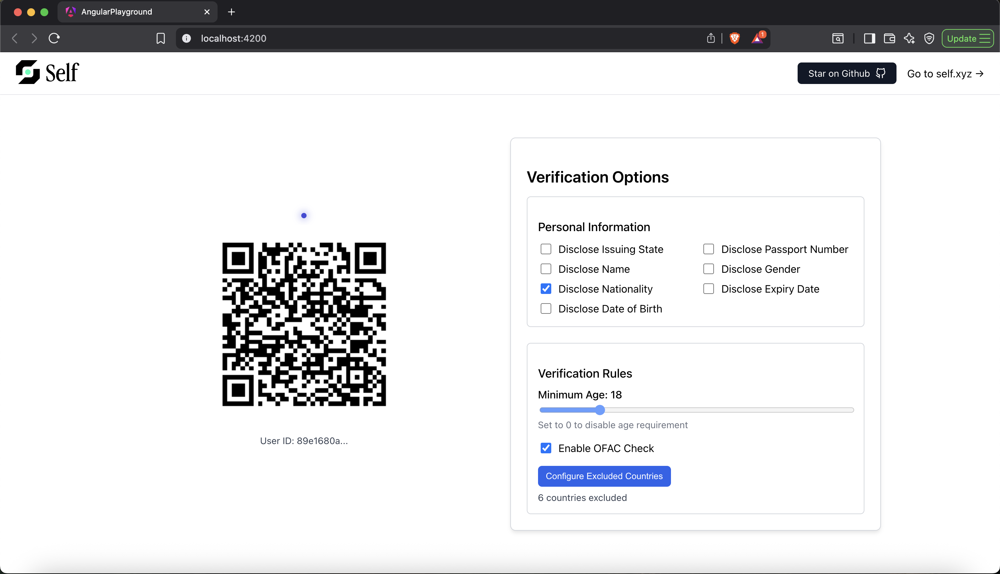
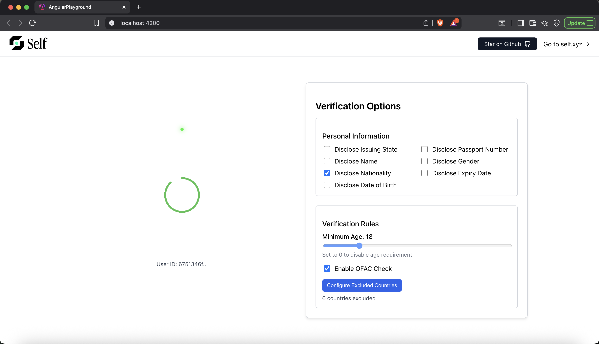
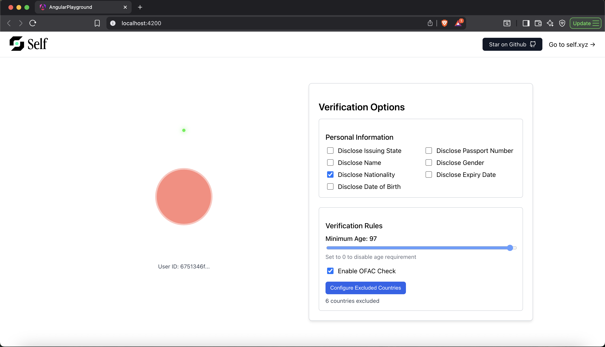

# Self Protocol - Angular Playground

A simple Angular implementation demonstrating [Self Protocol](https://github.com/selfxyz/self) - privacy-first identity verification using zero-knowledge proofs.

## Quick Start

### Frontend (Angular)
```bash
yarn install
yarn start
```
Runs on `http://localhost:4200`

### Backend (Go)
```bash
go run main.go
```
Runs on `http://localhost:8080`

## Screenshots

### Configuration Interface

Uses **InMemoryConfigStore** - a simple in-memory key-value store with these functions:
- `SetConfig()` - Stores verification config for a user ID
- `GetConfig()` - Retrieves stored config by user ID  
- `GetActionId()` - Returns user identifier for verification actions



*Frontend interface showing how users can modify verification configuration settings*

### Successful Verification

*Verification success screen displaying proof validation results*

### Failed Verification

*Error screen shown when proof verification fails*

## About

This is the Angular version of the [Self Playground](https://github.com/selfxyz/playground), showcasing how to integrate Self's identity verification capabilities for Sybil resistance and selective disclosure using real-world attestations.
